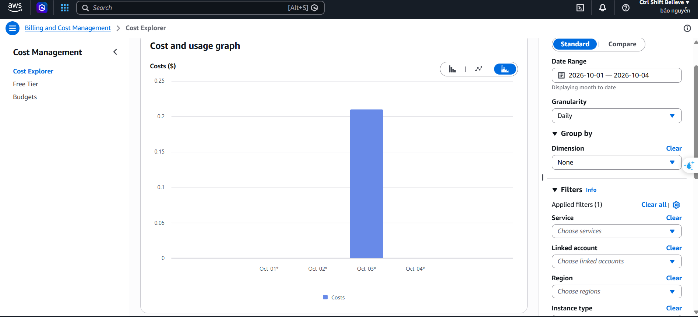

# Báo cáo Lab 16 — Cloud AI Environment Setup

## Cấu hình và nguồn kết quả

Kết quả dưới đây được đối chiếu từ `benchmark_result.json` và hai file log có sẵn trong thư mục bài, ghi nhận lần chạy lúc **18:39:10 ngày 03/10/2026, giờ Việt Nam (UTC+7)**. Phiên rà soát này không chạy lại benchmark trên EC2.

Theo báo cáo cũ và cấu hình Terraform, bài sử dụng AWS tại `ap-southeast-2`, compute node `t3.micro`, Ubuntu 22.04. Loại máy `t3.micro` có **2 vCPU và 1 GiB RAM** theo [tài liệu AWS](https://aws.amazon.com/ec2/instance-types/t3/). Log ghi nhận 914 MiB RAM khả dụng và 1 GiB swap. Compute node nằm trong private subnet, truy cập qua bastion, tải dữ liệu qua NAT Gateway; hạ tầng có ALB. GPU là phần tùy chọn và không được dùng trong bộ kết quả này.

Báo cáo cũ giải thích việc thay `us-east-1`/`t3.medium` bằng `ap-southeast-2`/`t3.micro` là do hạn chế SCP và Free Tier của tài khoản. Các lỗi và policy tương ứng chưa có log đính kèm để xác minh độc lập, nên đây là thông tin từ báo cáo cũ.

Dữ liệu `creditcard.csv` được rà soát trực tiếp: **284.807 dòng, 31 cột**, gồm 284.315 mẫu hợp lệ và 492 mẫu gian lận (**0,173%**), không có ô thiếu. File JSON ghi rõ `is_synthetic: false`. Chia train/test 80%/20%, stratify theo `Class`, seed 42: 227.845 / 56.962 mẫu.

## Kết quả benchmark đã lưu

| Chỉ số | Kết quả |
|---|---:|
| Thời gian nạp dữ liệu | 2.5745 s |
| Thời gian huấn luyện | 1.8747 s |
| Best iteration | 1 |
| AUC-ROC | 0.95165 |
| Accuracy | 0.99895 |
| F1-Score | 0.72727 |
| Precision | 0.65574 |
| Recall | 0.81633 |
| Latency một dòng, trung bình 200 lượt | 1.2365 ms |
| Throughput lô 1.000 dòng, trung bình 20 lượt | 650,534.16 dòng/s |
| Thời gian lô 1.000 dòng | 1.54 ms |

## Nhận xét ngắn

1. Log đã lưu ghi nhận nạp gần 285.000 giao dịch trong 2,5745 giây và huấn luyện trong 1,8747 giây trên CPU.
2. AUC-ROC 0,95165 cho thấy khả năng xếp hạng phân biệt hai lớp tốt trong phép đánh giá này; Recall 0,81633 phản ánh tỷ lệ phát hiện mẫu gian lận.
3. Accuracy 0,99895 cần đọc cùng F1 0,72727 và Precision 0,65574 vì dữ liệu rất mất cân bằng; dự đoán toàn bộ là hợp lệ cũng đạt khoảng 99,827% accuracy.
4. Best iteration = 1 là vòng có metric validation tốt nhất theo cơ chế early stopping; số này không cho biết tổng số cây đã thử, cũng không chứng minh PCA tách lớp hoàn hảo ngay cây đầu tiên.
5. Latency trung bình một dòng là 1,2365 ms; throughput lô 1.000 dòng khoảng 650.534 dòng/s. Đây là thời gian gọi mô hình, chưa tính mạng hay tầng API.
6. Log tài nguyên sau benchmark ghi nhận CPU idle 100%, RAM toàn hệ thống dùng 205,1 MiB và swap dùng 4 MiB; đây không phải RAM đỉnh hoặc RAM riêng của tiến trình huấn luyện.
7. Mã hiện dùng tập test làm `eval_set` để chọn best iteration, nên metric này chưa đến từ tập test độc lập với bước chọn mô hình. Lần đánh giá cải tiến cần train/validation/test riêng.
8. State Terraform hiện có 0 tài nguyên. Kiểm tra AWS chỉ đọc lúc 19:11:23 ngày 03/10/2026 (UTC+7) xác nhận không còn EC2 chưa kết thúc, EBS volume/snapshot do tài khoản sở hữu, Elastic IP hoặc Load Balancer tại `ap-southeast-2`; NAT của bài đã `deleted` và không còn VPC `AI-VPC`. Ảnh Cost Explorer bổ sung cho thấy chi phí ngày 03/10/2026 khoảng **0,21 USD** trong phạm vi bộ lọc đang áp dụng; chưa có phân rã theo dịch vụ.

## Chi phí ghi nhận trên AWS Cost Explorer

Ảnh do người dùng cung cấp ngày **04/10/2026** hiển thị khoảng thời gian **01–04/10/2026**, Granularity = **Daily**, Group by (Dimension) = **None** và **Applied filters (1)**. Cột ngày **03/10/2026** nằm ngay trên mức 0,20 USD, tương ứng khoảng **0,21 USD** theo trục biểu đồ. Đây là giá trị đọc xấp xỉ từ ảnh, chưa phải số tiền chính xác từ tooltip hoặc bảng chi phí.

Ảnh mới cho thấy Cost Explorer đã ghi nhận chi phí phát sinh, thay cho ảnh trước đó hiển thị 0,00 USD. Do ảnh không hiển thị chi tiết bộ lọc đang áp dụng và không nhóm theo dịch vụ, chưa thể xác định khoản tiền này bao gồm những tài nguyên nào hoặc quy toàn bộ cho bài lab. Cần bảng chi tiết hoặc ảnh Group by = Service để phân biệt chi phí EC2, NAT Gateway và ALB.

## Giới hạn minh chứng và việc còn thiếu

- Hai ảnh terminal và log được giữ nguyên từ bộ bài có sẵn. Phiên rà soát kiểm tra tính nhất quán nội dung nhưng chưa xác minh nguồn gốc ảnh terminal là ảnh chụp trực tiếp.
- `screenshot_billing.png` đã được thay bằng ảnh Cost Explorer mới do người dùng cung cấp ngày 04/10/2026 và được chèn ở phần chi phí phía trên. Chi phí khoảng 0,21 USD được đọc từ chiều cao cột ngày 03/10; ảnh chưa hiển thị số tiền chính xác, chi tiết bộ lọc hoặc phân rã theo dịch vụ.
- Minh chứng chi phí đã có số liệu phát sinh; phần còn thiếu là ảnh hoặc bảng chi tiết theo dịch vụ EC2, NAT Gateway và ALB để đối chiếu khoản chi của bài lab.
- Đã kiểm tra trực tiếp tại `ap-southeast-2`: 0 EC2 chưa kết thúc, 0 EBS volume, 0 EBS snapshot do tài khoản sở hữu, 0 Elastic IP, 0 Load Balancer loại ALB/NLB/GWLB và Classic; NAT còn xuất hiện trong danh sách đã ở trạng thái `deleted`. Không còn VPC `AI-VPC`. Chưa kiểm tra dịch vụ khác hoặc vùng khác; kiểm tra này không xác định số tiền đã phát sinh trước khi dọn tài nguyên.

## Tệp đính kèm

`benchmark.py`, `benchmark_result.json`, hai file log terminal, ba ảnh hiện có, mã Terraform trong `terraform/` và `terraform.zip`, cùng `kiem_tra_bo_bai.md`.

Gói nộp không chứa AWS Access Key, private SSH key, Terraform state/backup hoặc bộ provider tải về. CSV dữ liệu 150,8 MB được giữ ở thư mục gốc để tránh nén lại dữ liệu không được yêu cầu nộp.

Nguồn giải thích early stopping: [LightGBM](https://lightgbm.readthedocs.io/en/latest/pythonapi/lightgbm.early_stopping.html).
